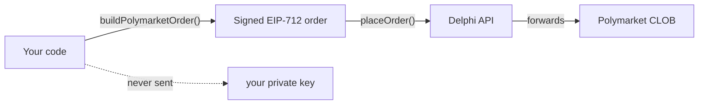

The Delphi Trading SDK (`@delphimarkets/sdk`) is a TypeScript library that lets you place, query, and cancel orders on six prediction markets through a single unified interface. It wraps the Delphi REST API and adds client-side helpers for the on-chain exchanges that require EIP-712 signed orders.

| Exchange | Chain | Wallet | Signing |
| --- | --- | --- | --- |
| Polymarket | Polygon | Gnosis Safe | Client-side EIP-712 |
| Kalshi | — | — | Server-side RSA-PSS |
| Opinion Labs | BNB Chain | Gnosis Safe | Client-side EIP-712 |
| Gemini Predictions | — | — | Server-side HMAC-SHA512 |
| Limitless | Base | EOA | Client-side EIP-712 |
| Predict.fun | BNB Chain | Predict Account / EOA | Client-side EIP-712 |

## Install

<CodeGroup>
```bash npm
npm install @delphimarkets/sdk
```

```bash pnpm
pnpm add @delphimarkets/sdk
```

```bash yarn
yarn add @delphimarkets/sdk
```
</CodeGroup>

Requires Node 18+ (uses native `fetch`).

## Configure

```typescript
import { DelphiClient } from '@delphimarkets/sdk';

const client = new DelphiClient({
  apiKey: process.env.DELPHI_API_KEY,        // your_api_key from your Delphi account
  baseUrl: 'https://api.delphiterminal.co',  // production
  timeout: 30_000,                            // optional, default 30s
});
```

| Option | Type | Default | Description |
| --- | --- | --- | --- |
| `apiKey` | `string` | required | Your Delphi API key. Sent as the `X-API-Key` header. |
| `baseUrl` | `string` | `http://localhost:8080` | Use `https://api.delphiterminal.co` in production. |
| `timeout` | `number` | `30000` | Request timeout in milliseconds. |

## Authentication

Every request to the Delphi API requires the `X-API-Key` header:

```http
X-API-Key: your_api_key_here
```

The SDK adds this automatically based on the `apiKey` you pass to `DelphiClient`. Don't expose your key in client-side code (browser apps) — proxy through your own backend.

## How signing works

This is the most important concept to understand before you write any trading code.

<Warning>
**On-chain exchanges require client-side EIP-712 signed orders.** Your private key must produce the signature locally and never leave your machine. The Delphi server cannot — and intentionally does not — have access to your private key. If you call `POST /api/v1/orders` with an unsigned or invalidly-signed payload, the underlying exchange will reject it.

This applies to **Polymarket, Opinion Labs, Limitless, and Predict.fun**.

The SDK's `build*Order()` helpers do all of this for you — pass in your private key (via a [viem](https://viem.sh) `WalletClient`) and they return a fully-signed payload ready for `placeOrder()`.
</Warning>

For **Kalshi** and **Gemini**, the server signs with credentials you registered ahead of time (RSA private key for Kalshi, HMAC secret for Gemini). No client-side cryptography needed.



## Quick example: Polymarket order

```typescript
import { DelphiClient, buildPolymarketOrder } from '@delphimarkets/sdk';
import { createWalletClient, http } from 'viem';
import { privateKeyToAccount } from 'viem/accounts';
import { polygon } from 'viem/chains';

const client = new DelphiClient({
  apiKey: process.env.DELPHI_API_KEY!,
  baseUrl: 'https://api.delphiterminal.co',
});

// One-time: derive Polymarket CLOB credentials
await client.derivePolymarketCredentials(process.env.POLYMARKET_PRIVATE_KEY!);

// Per-order: sign locally and place
const account = privateKeyToAccount(`0x${process.env.POLYMARKET_PRIVATE_KEY!}`);
const wallet = createWalletClient({ account, chain: polygon, transport: http() });

const signedOrder = await buildPolymarketOrder(
  {
    tokenId: '12345...',
    side: 'BUY',
    price: 0.55,
    size: '5000000', // 5 USDC, 6 decimals
  },
  wallet,
  true,
);

const order = await client.placeOrder({
  exchange: 'polymarket',
  market_id: 'my-market',
  order_type: 'GTC',
  signed_order: signedOrder,
});

console.log(`Placed: ${order.order_id} (${order.status})`);
```

For full per-exchange flows, see the per-exchange guides:

<CardGroup cols={2}>
  <Card title="Polymarket" icon="layer-group" href="/trading/polymarket">
    EIP-712 signed orders, Gnosis Safe wallet on Polygon
  </Card>
  <Card title="Kalshi" icon="building-columns" href="/trading/kalshi">
    Server-side RSA-PSS signing, US-regulated
  </Card>
  <Card title="Opinion Labs" icon="comments" href="/trading/opinion-labs">
    EIP-712 + Safe on BNB Chain
  </Card>
  <Card title="Gemini Predictions" icon="gem" href="/trading/gemini">
    Server-side HMAC-SHA512 signing
  </Card>
  <Card title="Limitless" icon="infinity" href="/trading/limitless">
    EIP-712 signed orders, EOA wallet on Base
  </Card>
  <Card title="Predict.fun" icon="rocket" href="/trading/predict-fun">
    EIP-712 + Kernel smart wallet on BNB Chain
  </Card>
</CardGroup>

## Order management

The same four methods work for every exchange:

```typescript
// Get a single order's status
const status = await client.getOrder(orderId, 'polymarket');

// List all of your tracked orders, optionally filtered by exchange
const all = await client.listOrders();
const polyOnly = await client.listOrders('polymarket');

// Cancel a resting order
await client.cancelOrder(orderId, 'polymarket');
```

The `exchange` argument is optional on `getOrder` and `cancelOrder` — the server can resolve it from the order store. Passing it explicitly is slightly faster.

## Credentials

For Kalshi, Gemini, Opinion Labs, Limitless, and Predict.fun, register your exchange credentials once, then place orders without further auth setup:

```typescript
await client.registerCredentials('kalshi', {
  api_key: process.env.KALSHI_API_KEY_ID!,
  api_secret: kalshiRSAPrivateKeyPEM,
  api_passphrase: '',
});
```

For Polymarket, use the dedicated derive helper instead — it handles the CLOB HMAC derivation in one call:

```typescript
await client.derivePolymarketCredentials(process.env.POLYMARKET_PRIVATE_KEY!);
```

List which exchanges you've connected:

```typescript
const { exchanges } = await client.listCredentials();
// e.g. ['kalshi', 'polymarket', 'limitless']
```

## Error handling

Every API error is wrapped in a `DelphiError` that exposes the HTTP status code and a server-provided message:

```typescript
import { DelphiError } from '@delphimarkets/sdk';

try {
  await client.placeOrder(req);
} catch (err) {
  if (err instanceof DelphiError) {
    console.error(`API error ${err.statusCode}: ${err.message}`);
    // 400 = bad request (malformed signed_order)
    // 401 = auth failed (invalid X-API-Key)
    // 403 = forbidden
    // 502 = upstream exchange returned an error
  }
}
```

Network and timeout errors surface as standard `AbortError` / `TypeError`. The SDK does not auto-retry — that's intentional, since order placement is non-idempotent.

## TypeScript types

All public types are exported from the package root:

```typescript
import type {
  DelphiConfig,
  PlaceOrderRequest,
  PlaceOrderResponse,
  OrderStatusResponse,
  Exchange,
  OrderType,
  OrderSide,
  SignedPolymarketOrder,
  KalshiLimitOrder,
  GeminiPredictionOrder,
  SignedLimitlessOrder,
  PredictFunOrderPayload,
} from '@delphimarkets/sdk';
```

The package ships ESM, CJS, and `.d.ts` declarations for full IDE auto-completion.

## Resources

<CardGroup cols={2}>
  <Card title="GitHub" icon="github" href="https://github.com/piraterobot0/delphi-sdk">
    Source code, issues, releases
  </Card>
  <Card title="npm" icon="npm" href="https://www.npmjs.com/package/@delphimarkets/sdk">
    Package page, version history
  </Card>
</CardGroup>
